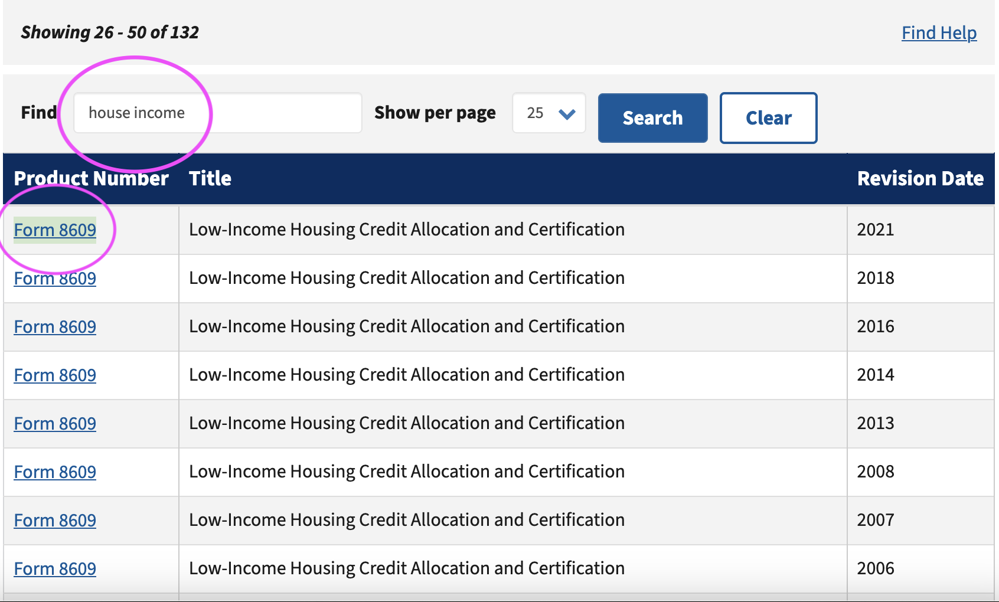
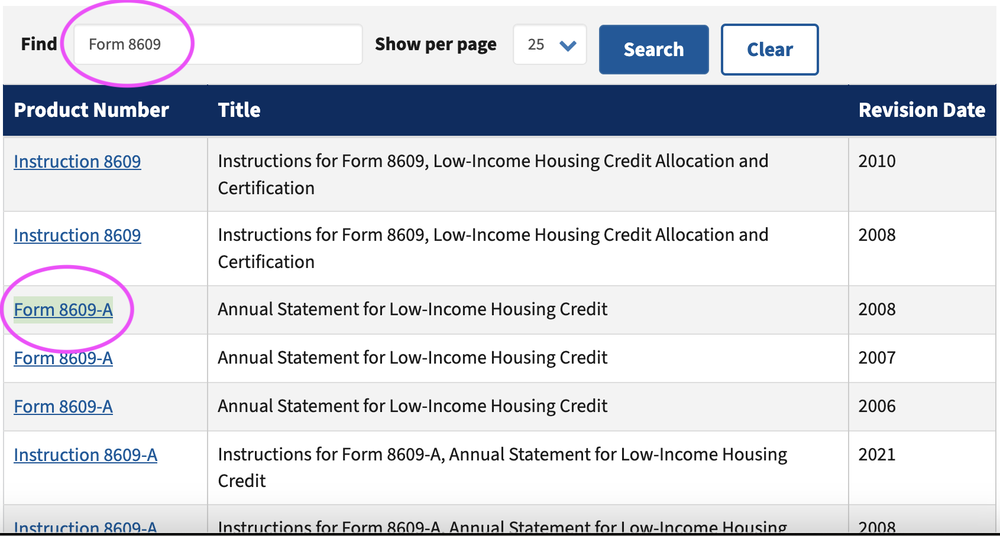
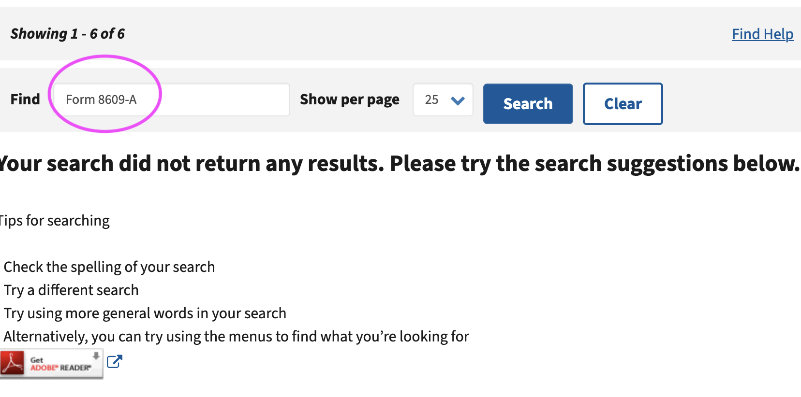

# How to run these two scripts:

*Ensure you have Python 3.10.0 installed* 

### Set up a virtual environment via terminal/CLI:
`virtualenv env`

###  Activate the env:
`source env/bin/activate`

### Install needed libraries for each respective utility:
`pip3 install -r utility1/reqs.txt` or `pip3 install -r utility2/reqs.txt`

###  Before running the scripts, you will need your own variables...environmental variables to be exact.
Follow the steps in `setting_up_env_vars.md` to set these up yourself and familiarize yourself with the Network tab in your browser

### Command line arguments for `utility1.py` from root dir:
`python utility1/utility1.py utility1/search_terms.txt`


###  Test cases to put in `search_terms.txt`:
```
Ex:
Abatement
instructions

Ex:
Abatement instructions

Ex:
Form 1095-C

Ex:
Form W-2

Ex:
Beyonce

Ex:
-left blank-

Ex:
house
tax
Form
```
# Run test for utility1.py
`python selenium-test.py`


# How script takes input parameters:
A file entitled `search_terms.txt` can be updated within the codebase. Each search query is preferrably on seperate lines. 

For example: `Form 1095-C` is one query and can be written on one line. Writing `Form` on one line and `1095-C` on another will give you same results. Putting `house` on the line after that line will give you far less results given IRS prior docs search algorithim. 

# How script outputs results for `utility1.py`:
Into the `utility1_results.html` file as json

# Troubleshooting
Verify the IRS search HTML page structure hasn't changed! One issue with integration/reverse engineering API's for sites that don't have one is changing tree structures.

Ensure your search terms file is correctly formatted with one term per line.

## Feedback on take home assessment that I turned in on time, includes utility1.py and part of utility2.py:
It was difficult to me, but not in an "I'm sweating way". I was more so interested in refamiliarizing myself with the Network tab in the Inspector. I spent many months in this tab during my contract at KBR, Inc. and things that took me a while to learn all came together for this assignment. I learned new tricks in Selenium. 

----------
# Specific instructions for `utility2.py`:

###  Command line arguments for `utility2.py` from root dir:
`python utility2/utility2.py`


###  Test cases to put in `queries.txt`:
```
Ex:
Form 1095-C
2021 - 2024

Ex:
Form W-2
2018 - 2022

Ex:
Form 8835
1800-2024

Ex:
Form 8609-A
1800-2024
```

One thing to note about the above examples for `utility2.py`:
This method of search is spotty. It's the IRS not you! Searching for the form 'Form 8609-A", "Form 8609" and even the keywords "house income" all return varyin results depending on the query, but not necessarily the ones you are looking for or need. See image:

Looking for Form 8609 via Title:


Looking for Form 8609 via query, but only Form 8609-A is queried:


Looking for Form 8609 via exact Product Number match:


*Should I email them?* ;)

## Feedback on take home assessment that I completed (seen here in github) after time alotted, includes a working utility2.py:
Nothing daunting. I just really wanted to finish. I was able to use a lot of the logic from `utility2.py`. I like that I broke this script up and made it modular. There's something satisfying knowing the data I wrangled is now accessbile, easy to capture and pretty all because of this script (minus the irs.gov search feature inconsistencies). I didn't necessarily learn anything new, but would've liked to.

-----------

# Some takeaways:

* One known flaw that I have in utility1.py is that when aggregating 'samemess' across form numbers and titles, the min/max currently calculates min/max by page number and not across all pages. I would implement that in version 2.

* Finally used a dictionary to keep track of items outside of it being independant of eventual JSON trandsformation (the 'occurrences' variable in utility1.py)

* REST Client extension in VSCode came in handy per usual

* Although I used Ch*tGPT for certain helper functions, I found that there's no way (still) that it can take the place of background knowledge and the power of understanding certain logic. For example, I'd use it to pattern-match a much simpler concept in order to implement a complex one for utility2.py, but even on the small tasks it'd hallucinate. I also know that the free version is less up to date, so being aware of out of date libraries etc is key.

* IRS.gov building this endpoint without having  id's on the table data was...a choice

* I started off solving the min/max wrong, then corrected it. My attempts are commented out

* I also wrote in Selenium for the second time and this time was much easier having played around with it before. I usually do test driven developemnt by creating fail-safes for scripts. For web apps on teams, I have experience in CI/CD, and have made several PR's on my small team (big project) during my time at KBR doing fullstack and integration work.

* Great podcast from [Syntax: Tasty Web Development Treats](https://syntax.fm/show/60/the-undocumented-web-scraping-private-apis-proxies-and-alternative-solutions) on web scraping I used to prep (although they used JS which is what I've mainly used to get data in personal and work projects): 
    * [Web Scraping + Reverse Engineering APIs - 2024](https://open.spotify.com/episode/6QuwVPSE0iSORqDnx4VSVN?si=0935ad346c2541f2)
    * [The Undocumented Web - scraping, private APIs, proxies and “alternative solutions" -2018](https://open.spotify.com/episode/0YfWhIdgACU1fRSY9chGWq?si=ebfdab9a01bd4f39)
