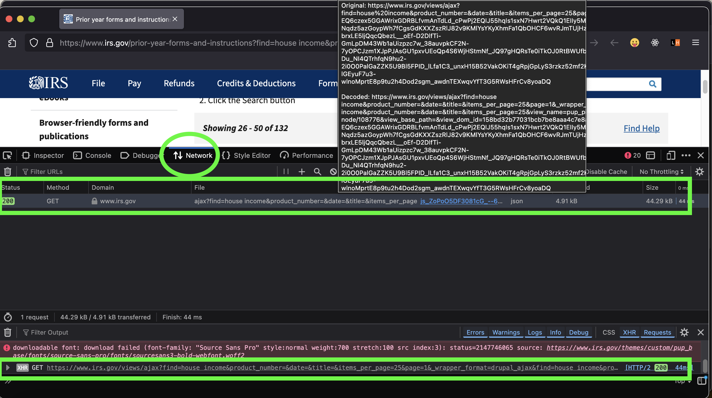
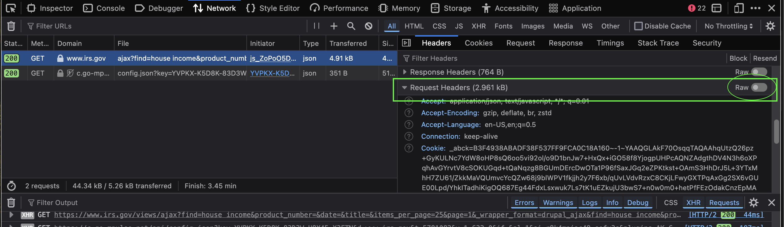
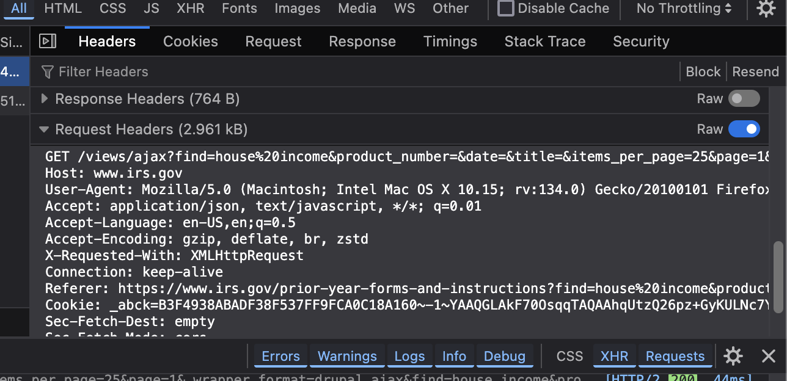
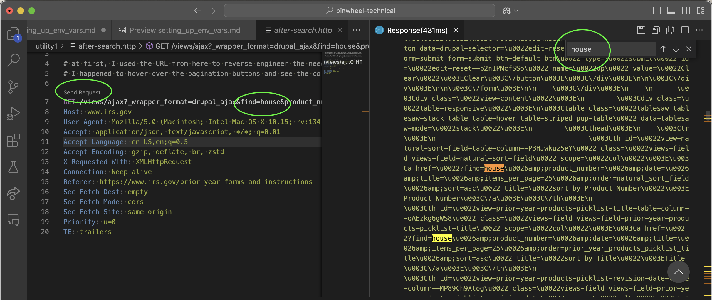

## Step-by-Step Guide to Create Your `.env` File

### **1. Accessing the IRS Endpoint**
1. **Visit the IRS Prior Year Forms and Instructions Page**: Go to [this endpoint](https://www.irs.gov/prior-year-forms-and-instructions?find=house%20income&product_number=&date=&title=&items_per_page=25&page=1).


### **2. Using Browser Developer Tools (when postiioned at bottom of browser)**
1. **Open Browser Developer Tools**: Before clicking the 'Search' button, open the browser developer tools. This is usually done by right-clicking on the page and selecting ‘Inspect’ or pressing `Ctrl+Shift+I` (Windows/Linux) or `Cmd+Option+I` (Mac).
2. **Navigate to the 'Network' tab**: In the developer tools, go to the ‘Network’ tab. This tab shows the network requests made when interacting with the website. Click "Search" on the webpage (outside of the Inspect tool)
3. **Find the relevant API request**: Look for the network request related to the 'search' button click. The request will typically include a POST or GET method and contain the query parameters. Click on the request.
   


1. **Copy the header data**: Click on Header. Scroll down to "Request Headers" Click on the 'Raw' toggle button and copy the "request" payload/data (usually in JSON format) which contains the data you need. 





This same request can be copied/as-is and pasted into an empty .http file and used with VSCodes REST client to see responses in the IDE. See here:



### **3. Using ChatGPT to Generate the `.env` File**
1. **Paste the copied data** into ChatGPT. Exclude sensitive data like cookies, etc
2. **Request ChatGPT to create an `.env` file**: In ChatGPT, ask it to generate an `.env` file based on the data you provided. You can phrase your request like:
   ```markdown
   "Based on the data I provided, please create an .env file with the necessary environment variables for my project so I can save it in a secure directory (e.g., .gitignore) in my workspace."
   ```
3. **ChatGPT will generate the `.env` file**: It will use the information from the IRS page data to create environment variables such as user-agent, cookies, user settings, etc.

### **4. Saving and Using the `.env` File**
1. **Save the generated `.env` file** in a secure directory, such as `/config/.env` or `/secrets/.env`. Make sure this directory is included in `.gitignore`:
   ```plaintext
   /config/.env
   /secrets/.env
   ```
2. **Integrate it into your project**: Use a library like `python-dotenv` in Python to load the `.env` file into `utility1.py`  and `utility2.py` for example:
   ```python
   from dotenv import load_dotenv
   import os

   load_dotenv('/path/to/your/.env')  # Load environment variables

   headers = {
    "Host": os.getenv("HEADERS_HOST"),
    "User-Agent": os.getenv("USER_AGENT"),
    "Accept": os.getenv("ACCEPT"),
    "Accept-Language": os.getenv("ACCEPT_LANGUAGE"),
    "Accept-Encoding": os.getenv("ACCEPT_ENCODING"),
    "X-Requested-With": os.getenv("X_REQUESTED_WITH"),
    "Connection": "keep-alive",
    "Referer": os.getenv("REFERER"),
    "Cookie": os.getenv("COOKIE"),
    "Sec-Fetch-Dest": os.getenv("SEC_FETCH_DEST"),
    "Sec-Fetch-Mode": os.getenv("SEC_FETCH_MODE"),
    "Sec-Fetch-Site": os.getenv("SEC_FETCH_SITE"),
    "Priority": os.getenv("PRIORITY"),
    "TE": os.getenv("TE")}
    
Use the env variables as needed throughout code
   

3. **Secure Directory (.gitignore) Considerations**
- Ensure that the directory where the `.env` file is stored is in `.gitignore`. This will prevent the file from being committed to version control.
  ```plaintext
  /config/.env
  /secrets/.env
  ```